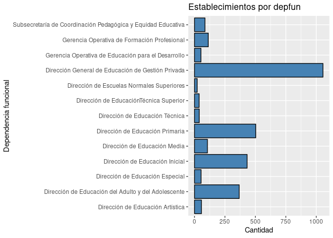
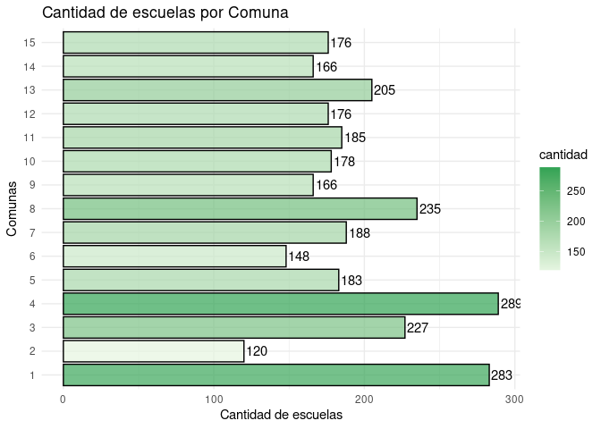
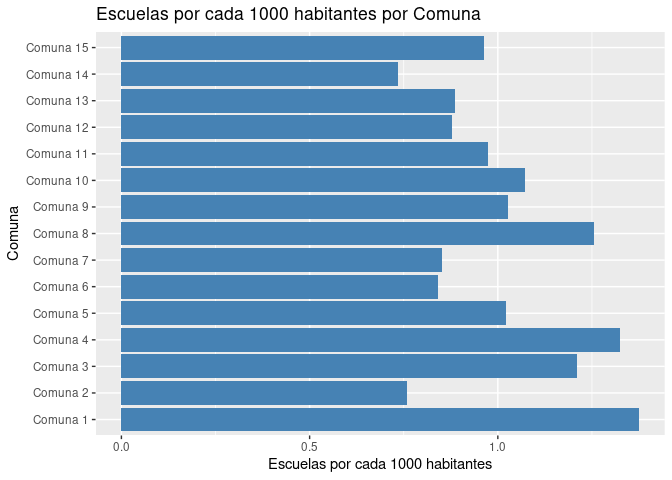
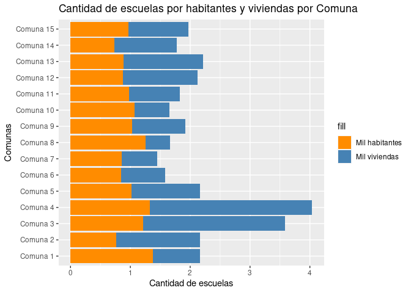
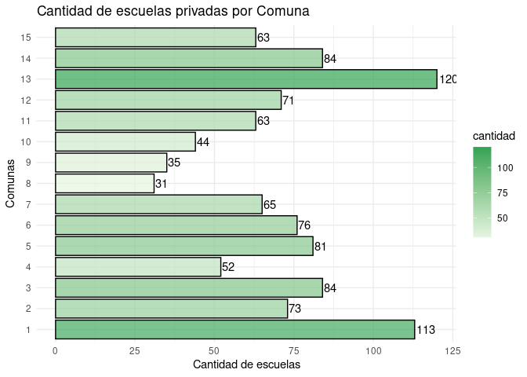
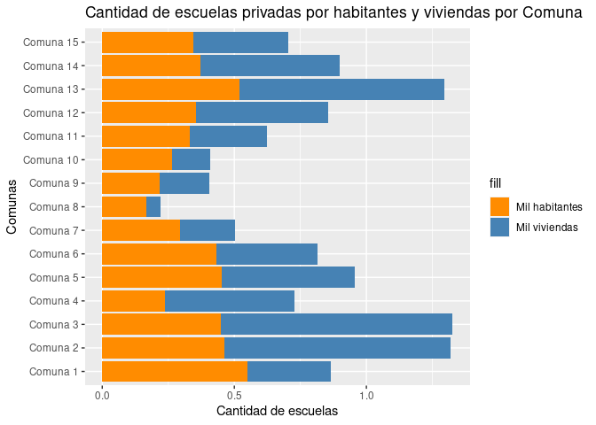

Proyecto Ciencia de Datos I
================
Maxi Urso
2023-07-09

Voy a trabajar con la base de datos de establecimientos educativos
disponible en BA Data.

**La idea es ver cómo se distribuyen los establecimientos educativos en
las comunas de la Ciudad de Buenos Aires**

Además, si bien el join no es algo que vimos en este módulo, para poder
hacer algunas operaciones extra voy a unirla con la base de datos del
censo 2010 para AMBA facilitada en este curso para calcular la cantidad
de escuelas por cantidad de habitantes y viviendas.

Los datos están disponibles en el [repositorio
git](https://github.com/maxiwebs/R-ProyectoCsDatos1/).

# Importo librerías

``` r
library(tidyverse)
library(ggplot2)
```

# Levanto base escuelas

``` r
escuelas <- read_csv('data/establecimientos_educativos_WGS84.csv')
summary(escuelas)
```

    ##       cui            cueanexo             cue             anexo       
    ##  Min.   :200001   Min.   :20000100   Min.   :200001   Min.   : 0.000  
    ##  1st Qu.:200455   1st Qu.:20084300   1st Qu.:200843   1st Qu.: 0.000  
    ##  Median :200901   Median :20159822   Median :201598   Median : 0.000  
    ##  Mean   :201110   Mean   :20184427   Mean   :201844   Mean   : 3.253  
    ##  3rd Qu.:201716   3rd Qu.:20240100   3rd Qu.:202401   3rd Qu.: 0.000  
    ##  Max.   :202731   Max.   :29003001   Max.   :290030   Max.   :99.000  
    ##      sector       dom_edific         dom_establ         nombre_est       
    ##  Min.   :1.000   Length:2973        Length:2973        Length:2973       
    ##  1st Qu.:1.000   Class :character   Class :character   Class :character  
    ##  Median :1.000   Mode  :character   Mode  :character   Mode  :character  
    ##  Mean   :1.363                                                           
    ##  3rd Qu.:2.000                                                           
    ##  Max.   :2.000                                                           
    ##   nombre_abr          telefono            email             codpost         
    ##  Length:2973        Length:2973        Length:2973        Length:2973       
    ##  Class :character   Class :character   Class :character   Class :character  
    ##  Mode  :character   Mode  :character   Mode  :character   Mode  :character  
    ##                                                                             
    ##                                                                             
    ##                                                                             
    ##   web_megcba           nivmod           nivelmodal         tipest_abr       
    ##  Length:2973        Length:2973        Length:2973        Length:2973       
    ##  Class :character   Class :character   Class :character   Class :character  
    ##  Mode  :character   Mode  :character   Mode  :character   Mode  :character  
    ##                                                                             
    ##                                                                             
    ##                                                                             
    ##     tipest             depfun           depfun_otr              de        
    ##  Length:2973        Length:2973        Length:2973        Min.   : 1.000  
    ##  Class :character   Class :character   Class :character   1st Qu.: 4.000  
    ##  Mode  :character   Mode  :character   Mode  :character   Median : 9.000  
    ##                                                           Mean   : 9.637  
    ##                                                           3rd Qu.:15.000  
    ##                                                           Max.   :21.000  
    ##      comuna          barrio           area_progr            estado     
    ##  Min.   : 1.000   Length:2973        Length:2973        Min.   :1.000  
    ##  1st Qu.: 4.000   Class :character   Class :character   1st Qu.:1.000  
    ##  Median : 8.000   Mode  :character   Mode  :character   Median :1.000  
    ##  Mean   : 7.654                                         Mean   :1.155  
    ##  3rd Qu.:11.000                                         3rd Qu.:1.000  
    ##  Max.   :15.000                                         Max.   :4.000  
    ##     point_x          point_y          nivel          
    ##  Min.   : 93958   Min.   : 92910   Length:2973       
    ##  1st Qu.: 98888   1st Qu.: 99347   Class :character  
    ##  Median :101998   Median :101691   Mode  :character  
    ##  Mean   :102033   Mean   :101708                     
    ##  3rd Qu.:105320   3rd Qu.:104019                     
    ##  Max.   :110324   Max.   :110326

# Veo dimensión de la base

``` r
dim(escuelas)
```

    ## [1] 2973   27

**2973 registros, 27 columnas.**

# Veo columnas de la base escuelas

``` r
colnames(escuelas)
```

    ##  [1] "cui"        "cueanexo"   "cue"        "anexo"      "sector"    
    ##  [6] "dom_edific" "dom_establ" "nombre_est" "nombre_abr" "telefono"  
    ## [11] "email"      "codpost"    "web_megcba" "nivmod"     "nivelmodal"
    ## [16] "tipest_abr" "tipest"     "depfun"     "depfun_otr" "de"        
    ## [21] "comuna"     "barrio"     "area_progr" "estado"     "point_x"   
    ## [26] "point_y"    "nivel"

# Selecciono columnas

Dejo las columnas con las que me voy a quedar

``` r
escuelas <- escuelas %>% 
  select(cue,nombre_abr,depfun,de,comuna,barrio)
```

# Inspecciono campos

``` r
summary(escuelas)
```

    ##       cue          nombre_abr           depfun                de        
    ##  Min.   :200001   Length:2973        Length:2973        Min.   : 1.000  
    ##  1st Qu.:200843   Class :character   Class :character   1st Qu.: 4.000  
    ##  Median :201598   Mode  :character   Mode  :character   Median : 9.000  
    ##  Mean   :201844                                         Mean   : 9.637  
    ##  3rd Qu.:202401                                         3rd Qu.:15.000  
    ##  Max.   :290030                                         Max.   :21.000  
    ##      comuna          barrio         
    ##  Min.   : 1.000   Length:2973       
    ##  1st Qu.: 4.000   Class :character  
    ##  Median : 8.000   Mode  :character  
    ##  Mean   : 7.654                     
    ##  3rd Qu.:11.000                     
    ##  Max.   :15.000

## Cantidad de escuelas por dependencia funcional

``` r
table(escuelas$depfun)
```

    ## 
    ##                                               Dirección de Educación Artística 
    ##                                                                             57 
    ##                            Dirección de Educación del Adulto y del Adolescente 
    ##                                                                            367 
    ##                                                Dirección de Educación Especial 
    ##                                                                             54 
    ##                                                 Dirección de Educación Inicial 
    ##                                                                            432 
    ##                                                   Dirección de Educación Media 
    ##                                                                            106 
    ##                                                Dirección de Educación Primaria 
    ##                                                                            503 
    ##                                                 Dirección de Educación Técnica 
    ##                                                                             39 
    ##                                        Dirección de Educación Técnica Superior 
    ##                                                                              2 
    ##                                         Dirección de EducaciónTécnica Superior 
    ##                                                                             38 
    ##                                      Dirección de Escuelas Normales Superiores 
    ##                                                                             22 
    ##                              Dirección General de Educación de Gestión Privada 
    ##                                                                           1055 
    ##                                          Dirección General Escuela de Maestros 
    ##                                                                              5 
    ##                             Gerencia Operativa de Educación para el Desarrollo 
    ##                                                                             53 
    ##                                    Gerencia Operativa de Formación Profesional 
    ##                                                                            113 
    ## Gerencia Operativa Gestión y Administración de Institutos de Formación Docente 
    ##                                                                              6 
    ##                                                        GO de Formación Laboral 
    ##                                                                              1 
    ##                   Subsecretaría de Coordinación Pedagógica y Equidad Educativa 
    ##                                                                             86

# Filtrando elementos

Voy a quitar las dependencias funcionales con menos de 10
establecimientos

Para ello tengo que agrupar y contar.

Luego ordeno por dependencia funcional en orden descendente.

``` r
escuelas_agrup_depfun <- escuelas %>% 
  group_by(depfun) %>% 
  summarise(cantidad = n()) %>% 
  arrange(-cantidad)

print(escuelas_agrup_depfun)
```

    ## # A tibble: 18 × 2
    ##    depfun                                                               cantidad
    ##    <chr>                                                                   <int>
    ##  1 Dirección General de Educación de Gestión Privada                        1055
    ##  2 Dirección de Educación Primaria                                           503
    ##  3 Dirección de Educación Inicial                                            432
    ##  4 Dirección de Educación del Adulto y del Adolescente                       367
    ##  5 Gerencia Operativa de Formación Profesional                               113
    ##  6 Dirección de Educación Media                                              106
    ##  7 Subsecretaría de Coordinación Pedagógica y Equidad Educativa               86
    ##  8 Dirección de Educación Artística                                           57
    ##  9 Dirección de Educación Especial                                            54
    ## 10 Gerencia Operativa de Educación para el Desarrollo                         53
    ## 11 Dirección de Educación Técnica                                             39
    ## 12 Dirección de EducaciónTécnica Superior                                     38
    ## 13 <NA>                                                                       34
    ## 14 Dirección de Escuelas Normales Superiores                                  22
    ## 15 Gerencia Operativa Gestión y Administración de Institutos de Formac…        6
    ## 16 Dirección General Escuela de Maestros                                       5
    ## 17 Dirección de Educación Técnica Superior                                     2
    ## 18 GO de Formación Laboral                                                     1

## Me quedo con las dependencias funcionales con menos de 10 establecimientos

``` r
dep_funcs_chicas <- escuelas_agrup_depfun %>% 
  filter(cantidad < 10)

print(dep_funcs_chicas)
```

    ## # A tibble: 4 × 2
    ##   depfun                                                                cantidad
    ##   <chr>                                                                    <int>
    ## 1 Gerencia Operativa Gestión y Administración de Institutos de Formaci…        6
    ## 2 Dirección General Escuela de Maestros                                        5
    ## 3 Dirección de Educación Técnica Superior                                      2
    ## 4 GO de Formación Laboral                                                      1

Quiero eliminar de la base escuelas las que corresponden a estas
dependencias funcionales.

Para ello construyo una lista de las dependencias funcionales chicas

``` r
lista_dep_funcs_chicas <- dep_funcs_chicas$depfun

lista_dep_funcs_chicas
```

    ## [1] "Gerencia Operativa Gestión y Administración de Institutos de Formación Docente"
    ## [2] "Dirección General Escuela de Maestros"                                         
    ## [3] "Dirección de Educación Técnica Superior"                                       
    ## [4] "GO de Formación Laboral"

Ahora quito de la base esas escuelas

``` r
escuelas <- escuelas %>% 
  filter(!(depfun %in% lista_dep_funcs_chicas))
```

Chequeo que ya no estén.

``` r
table(escuelas$depfun)
```

    ## 
    ##                             Dirección de Educación Artística 
    ##                                                           57 
    ##          Dirección de Educación del Adulto y del Adolescente 
    ##                                                          367 
    ##                              Dirección de Educación Especial 
    ##                                                           54 
    ##                               Dirección de Educación Inicial 
    ##                                                          432 
    ##                                 Dirección de Educación Media 
    ##                                                          106 
    ##                              Dirección de Educación Primaria 
    ##                                                          503 
    ##                               Dirección de Educación Técnica 
    ##                                                           39 
    ##                       Dirección de EducaciónTécnica Superior 
    ##                                                           38 
    ##                    Dirección de Escuelas Normales Superiores 
    ##                                                           22 
    ##            Dirección General de Educación de Gestión Privada 
    ##                                                         1055 
    ##           Gerencia Operativa de Educación para el Desarrollo 
    ##                                                           53 
    ##                  Gerencia Operativa de Formación Profesional 
    ##                                                          113 
    ## Subsecretaría de Coordinación Pedagógica y Equidad Educativa 
    ##                                                           86

Veo que todas son mayores a 10.

# Chequeo si hay y elimino valores nulos

``` r
any(is.na(escuelas$depfun))
```

    ## [1] TRUE

``` r
escuelas <- drop_na(escuelas)
```

# Grafico cantidad de escuelas por dependencia funcional

``` r
ggplot(escuelas, aes(y = factor(depfun)))+
  geom_bar(fill = "steelblue", color = "black", stat = "count") +
  labs(title = "Establecimientos por depfun", y = "Dependencia funcional", x = "Cantidad")
```

<!-- -->

# Grafico cantidad de escuelas por comuna

Agrupo por comuna y cuento

``` r
escuelas_agrup_comuna <- escuelas %>% 
  group_by(comuna) %>%
  summarise(cantidad = n()) %>% 
  arrange(comuna)

escuelas_agrup_comuna
```

    ## # A tibble: 15 × 2
    ##    comuna cantidad
    ##     <dbl>    <int>
    ##  1      1      283
    ##  2      2      120
    ##  3      3      227
    ##  4      4      289
    ##  5      5      183
    ##  6      6      148
    ##  7      7      188
    ##  8      8      235
    ##  9      9      166
    ## 10     10      178
    ## 11     11      185
    ## 12     12      176
    ## 13     13      205
    ## 14     14      166
    ## 15     15      176

## Grafico de barras de escuelas por comunas

``` r
ggplot(data = escuelas_agrup_comuna,
       aes(x = factor(comuna), y = cantidad, fill=cantidad))+ 
  geom_col(colour = 'black',
           alpha = 0.7)+
  scale_fill_gradient(low = "#e5f5e0", high = "#31a354")+
  labs (title = "Cantidad de escuelas por Comuna",
        x = "Comunas",
        y = "Cantidad de escuelas")+
  geom_text(aes(label = cantidad), hjust = -0.1)+ # Muestra los números sobre las barras
  theme_minimal()+
  coord_flip() #Roto el gráfico para que quede horizontal
```

<!-- -->

# Un poco de estadística

Genero una tabla resumen con cantidad de escuelas, el mínimo, máximo,
promedio y mediana

``` r
resumen <- escuelas_agrup_comuna %>% 
  summarise(max = max(cantidad),
            min = min(cantidad),
            promedio = mean(cantidad),
            mediana = median(cantidad))

resumen
```

    ## # A tibble: 1 × 4
    ##     max   min promedio mediana
    ##   <int> <int>    <dbl>   <int>
    ## 1   289   120      195     183

# Comunas con “muchas” y “pocas” escuelas

Voy a dividir en las comunas que tienen más o menos que la mediana

``` r
comunas_segun_cantidad_escuelas <- escuelas_agrup_comuna %>% 
  mutate(clasificacion = case_when(cantidad > 183 ~ "Muchas escuelas",
                                   cantidad < 183 ~ "Pocas escuelas",
                                   .default = "En la mediana"))

comunas_segun_cantidad_escuelas %>% 
  arrange(clasificacion,-cantidad)
```

    ## # A tibble: 15 × 3
    ##    comuna cantidad clasificacion  
    ##     <dbl>    <int> <chr>          
    ##  1      5      183 En la mediana  
    ##  2      4      289 Muchas escuelas
    ##  3      1      283 Muchas escuelas
    ##  4      8      235 Muchas escuelas
    ##  5      3      227 Muchas escuelas
    ##  6     13      205 Muchas escuelas
    ##  7      7      188 Muchas escuelas
    ##  8     11      185 Muchas escuelas
    ##  9     10      178 Pocas escuelas 
    ## 10     12      176 Pocas escuelas 
    ## 11     15      176 Pocas escuelas 
    ## 12      9      166 Pocas escuelas 
    ## 13     14      166 Pocas escuelas 
    ## 14      6      148 Pocas escuelas 
    ## 15      2      120 Pocas escuelas

# Levanto base censo 2010

``` r
censo_2010 <- read.csv('data/partidos_censo2010.csv')
summary(censo_2010)
```

    ##      codigo        nombre             pob_2010          viv_2010     
    ##  Min.   :2001   Length:48          Min.   :  56729   Min.   : 19287  
    ##  1st Qu.:2013   Class :character   1st Qu.: 174013   1st Qu.: 64864  
    ##  Median :6319   Mode  :character   Median : 223280   Median : 93388  
    ##  Mean   :5075                      Mean   : 301108   Mean   :104104  
    ##  3rd Qu.:6544                      3rd Qu.: 340722   3rd Qu.:123359  
    ##  Max.   :6861                      Max.   :1775816   Max.   :447306  
    ##     hog_2010     
    ##  Min.   : 17116  
    ##  1st Qu.: 59537  
    ##  Median : 81055  
    ##  Mean   : 95612  
    ##  3rd Qu.:109566  
    ##  Max.   :484909

# Chequeo nombres de columnas

``` r
colnames(censo_2010)
```

    ## [1] "codigo"   "nombre"   "pob_2010" "viv_2010" "hog_2010"

# Veo qué valores tiene la columna nombre

``` r
table(censo_2010$nombre)
```

    ## 
    ##       Almirante Brown            Avellaneda           Berazategui 
    ##                     1                     1                     1 
    ##               Berisso              Comuna 1             Comuna 10 
    ##                     1                     1                     1 
    ##             Comuna 11             Comuna 12             Comuna 13 
    ##                     1                     1                     1 
    ##             Comuna 14             Comuna 15              Comuna 2 
    ##                     1                     1                     1 
    ##              Comuna 3              Comuna 4              Comuna 5 
    ##                     1                     1                     1 
    ##              Comuna 6              Comuna 7              Comuna 8 
    ##                     1                     1                     1 
    ##              Comuna 9              Ensenada               Escobar 
    ##                     1                     1                     1 
    ## Esteban Echeverr\xeda                Ezeiza      Florencio Varela 
    ##                     1                     1                     1 
    ##  General Rodr\xedguez General San Mart\xedn            Hurlingham 
    ##                     1                     1                     1 
    ##          Ituzaing\xf3        Jos\xe9 C. Paz            La Matanza 
    ##                     1                     1                     1 
    ##              La Plata              Lan\xfas       Lomas de Zamora 
    ##                     1                     1                     1 
    ##              Luj\xe1n   Malvinas Argentinas                 Merlo 
    ##                     1                     1                     1 
    ##                Moreno              Mor\xf3n                 Pilar 
    ##                     1                     1                     1 
    ##   Presidente Per\xf3n               Quilmes          San Fernando 
    ##                     1                     1                     1 
    ##            San Isidro            San Miguel           San Vicente 
    ##                     1                     1                     1 
    ##                 Tigre       Tres de Febrero      Vicente L\xf3pez 
    ##                     1                     1                     1

# Filtro solo los datos de CABA

Para ello voy a seleccionar sólo las que contienen la palabra “Comuna”

``` r
censo_2010_CABA <- censo_2010 %>% 
  filter(str_detect(nombre, "Comuna"))

table(censo_2010_CABA$nombre)
```

    ## 
    ##  Comuna 1 Comuna 10 Comuna 11 Comuna 12 Comuna 13 Comuna 14 Comuna 15  Comuna 2 
    ##         1         1         1         1         1         1         1         1 
    ##  Comuna 3  Comuna 4  Comuna 5  Comuna 6  Comuna 7  Comuna 8  Comuna 9 
    ##         1         1         1         1         1         1         1

# Genero una columna Comuna

En la misma sólo voy a poner el número de la comuna para poder joinear

Tengo que castear a double porque sino queda como character

``` r
censo_2010_CABA_comunas <- censo_2010_CABA %>% 
  mutate(comuna = as.double(str_remove(nombre, "Comuna ")))

censo_2010_CABA_comunas$comuna
```

    ##  [1]  1 10 11 12 13 14 15  2  3  4  5  6  7  8  9

# Joineo censo con base de escuelas

``` r
escuelas_agrup_comuna_censo <- left_join(escuelas_agrup_comuna,censo_2010_CABA_comunas,by="comuna")

escuelas_agrup_comuna_censo
```

    ## # A tibble: 15 × 7
    ##    comuna cantidad codigo nombre    pob_2010 viv_2010 hog_2010
    ##     <dbl>    <int>  <int> <chr>        <int>    <int>    <int>
    ##  1      1      283   2001 Comuna 1    205886   130771    84468
    ##  2      2      120   2002 Comuna 2    157932    55377    73156
    ##  3      3      227   2003 Comuna 3    187537    63322    80489
    ##  4      4      289   2004 Comuna 4    218245    71572    76455
    ##  5      5      183   2005 Comuna 5    179005    84649    76846
    ##  6      6      148   2006 Comuna 6    176076    93409    75189
    ##  7      7      188   2007 Comuna 7    220591   129633    81483
    ##  8      8      235   2008 Comuna 8    187237   141222    58204
    ##  9      9      166   2009 Comuna 9    161797    86326    56495
    ## 10     10      178   2010 Comuna 10   166022   107967    61453
    ## 11     11      185   2011 Comuna 11   189832   101161    71460
    ## 12     12      176   2012 Comuna 12   200116    82926    78547
    ## 13     13      205   2013 Comuna 13   231331    92750   100506
    ## 14     14      166   2014 Comuna 14   225970    93368   102918
    ## 15     15      176   2015 Comuna 15   182574    89520    72465

# Calculo escuelas por cantidad de poblacion

En base a los datos del censo de 2010, por cada 1000 habitantes y cada
1000 viviendas.

``` r
escuelas_poblacion <- escuelas_agrup_comuna_censo %>% 
  mutate(escuelas_por_1000_hab = cantidad/(pob_2010/1000),
         escuelas_por_1000_viv = cantidad/(viv_2010/1000)) %>% 
  arrange(-escuelas_por_1000_hab)


escuelas_poblacion
```

    ## # A tibble: 15 × 9
    ##    comuna cantidad codigo nombre    pob_2010 viv_2010 hog_2010
    ##     <dbl>    <int>  <int> <chr>        <int>    <int>    <int>
    ##  1      1      283   2001 Comuna 1    205886   130771    84468
    ##  2      4      289   2004 Comuna 4    218245    71572    76455
    ##  3      8      235   2008 Comuna 8    187237   141222    58204
    ##  4      3      227   2003 Comuna 3    187537    63322    80489
    ##  5     10      178   2010 Comuna 10   166022   107967    61453
    ##  6      9      166   2009 Comuna 9    161797    86326    56495
    ##  7      5      183   2005 Comuna 5    179005    84649    76846
    ##  8     11      185   2011 Comuna 11   189832   101161    71460
    ##  9     15      176   2015 Comuna 15   182574    89520    72465
    ## 10     13      205   2013 Comuna 13   231331    92750   100506
    ## 11     12      176   2012 Comuna 12   200116    82926    78547
    ## 12      7      188   2007 Comuna 7    220591   129633    81483
    ## 13      6      148   2006 Comuna 6    176076    93409    75189
    ## 14      2      120   2002 Comuna 2    157932    55377    73156
    ## 15     14      166   2014 Comuna 14   225970    93368   102918
    ## # ℹ 2 more variables: escuelas_por_1000_hab <dbl>, escuelas_por_1000_viv <dbl>

# Gráfico de escuelas por cada 1000 habitantes por comuna

``` r
escuelas_poblacion <- escuelas_poblacion %>% 
  arrange(comuna)

ggplot(escuelas_poblacion, aes(x = escuelas_por_1000_hab, y = reorder(nombre,comuna))) +
  geom_bar(stat = "identity", fill = "steelblue") +
  labs(x = "Escuelas por cada 1000 habitantes", y = "Comuna") +
  ggtitle("Escuelas por cada 1000 habitantes por Comuna")
```

<!-- -->

``` r
ggplot(escuelas_poblacion, aes(y = reorder(nombre,comuna))) +
  geom_bar(aes(x = escuelas_por_1000_viv, fill = "Mil viviendas"), stat = "identity", position = "dodge") +
  geom_bar(aes(x = escuelas_por_1000_hab, fill = "Mil habitantes"), stat = "identity", position = "dodge") +
  labs(x = "Cantidad de escuelas", y = "Comunas") +
  scale_fill_manual(values = c("Mil viviendas" = "steelblue", "Mil habitantes" = "darkorange")) +
  ggtitle("Cantidad de escuelas por habitantes y viviendas por Comuna")
```

<!-- -->

## Escuelas privadas por comuna

Filtro para quedarme con sólo las escuelas con dependencia funcional
“Dirección General de Educación de Gestión Privada”

``` r
escuelas_privadas_por_comuna <- escuelas %>% 
  filter(depfun == "Dirección General de Educación de Gestión Privada") %>% 
  group_by(comuna) %>%
  summarise(cantidad = n()) %>% 
  arrange(-cantidad)

escuelas_privadas_por_comuna
```

    ## # A tibble: 15 × 2
    ##    comuna cantidad
    ##     <dbl>    <int>
    ##  1     13      120
    ##  2      1      113
    ##  3      3       84
    ##  4     14       84
    ##  5      5       81
    ##  6      6       76
    ##  7      2       73
    ##  8     12       71
    ##  9      7       65
    ## 10     11       63
    ## 11     15       63
    ## 12      4       52
    ## 13     10       44
    ## 14      9       35
    ## 15      8       31

``` r
ggplot(data = escuelas_privadas_por_comuna,
       aes(x = factor(comuna), y = cantidad, fill=cantidad))+ 
  geom_col(colour = 'black',
           alpha = 0.7)+
  scale_fill_gradient(low = "#e5f5e0", high = "#31a354")+
  labs (title = "Cantidad de escuelas privadas por Comuna",
        x = "Comunas",
        y = "Cantidad de escuelas")+
  geom_text(aes(label = cantidad), hjust = -0.1)+ # Muestra los números sobre las barras
  theme_minimal()+
  coord_flip() #Roto el gráfico para que quede horizontal
```

<!-- -->

## Cantidad de escuelas privadas por cada 1000 habitantes por Comuna

``` r
escuelas_priv_agrup_comuna_censo <-
  left_join(escuelas_privadas_por_comuna,censo_2010_CABA_comunas,by="comuna") %>%
  mutate(escuelas_por_1000_hab = cantidad/(pob_2010/1000),
         escuelas_por_1000_viv = cantidad/(viv_2010/1000)) %>% 
  arrange(-escuelas_por_1000_hab)

escuelas_priv_agrup_comuna_censo 
```

    ## # A tibble: 15 × 9
    ##    comuna cantidad codigo nombre    pob_2010 viv_2010 hog_2010
    ##     <dbl>    <int>  <int> <chr>        <int>    <int>    <int>
    ##  1      1      113   2001 Comuna 1    205886   130771    84468
    ##  2     13      120   2013 Comuna 13   231331    92750   100506
    ##  3      2       73   2002 Comuna 2    157932    55377    73156
    ##  4      5       81   2005 Comuna 5    179005    84649    76846
    ##  5      3       84   2003 Comuna 3    187537    63322    80489
    ##  6      6       76   2006 Comuna 6    176076    93409    75189
    ##  7     14       84   2014 Comuna 14   225970    93368   102918
    ##  8     12       71   2012 Comuna 12   200116    82926    78547
    ##  9     15       63   2015 Comuna 15   182574    89520    72465
    ## 10     11       63   2011 Comuna 11   189832   101161    71460
    ## 11      7       65   2007 Comuna 7    220591   129633    81483
    ## 12     10       44   2010 Comuna 10   166022   107967    61453
    ## 13      4       52   2004 Comuna 4    218245    71572    76455
    ## 14      9       35   2009 Comuna 9    161797    86326    56495
    ## 15      8       31   2008 Comuna 8    187237   141222    58204
    ## # ℹ 2 more variables: escuelas_por_1000_hab <dbl>, escuelas_por_1000_viv <dbl>

``` r
ggplot(escuelas_priv_agrup_comuna_censo, aes(y = reorder(nombre,comuna))) +
  geom_bar(aes(x = escuelas_por_1000_viv, fill = "Mil viviendas"), stat = "identity", position = "dodge") +
  geom_bar(aes(x = escuelas_por_1000_hab, fill = "Mil habitantes"), stat = "identity", position = "dodge") +
  labs(x = "Cantidad de escuelas", y = "Comunas") +
  scale_fill_manual(values = c("Mil viviendas" = "steelblue", "Mil habitantes" = "darkorange")) +
  ggtitle("Cantidad de escuelas privadas por habitantes y viviendas por Comuna")
```

<!-- -->

# Conclusiones

**Respecto a los datos obtenidos de la base de escuelas:**

## Cantidad de escuelas totales por comuna

- Las comunas 4 y 1 son las que tienen mayor cantidad de escuelas.
- Las comunas 2 y 6 son las que tienen menor cantidad de escuelas.

## Cantidad de escuelas privadas por comuna

- Las comunas 13 y 1 son las que tienen más cantidad de escuelas
  privadas con 120 y 113 escuelas, seguidas por las comunas 3 y 14 con
  84 escuelas privadas cada una.
- Las comunas con menor cantidad de escuelas privadas son las comunas 8,
  9 y 10.

**Respecto a los datos cruzados por cantidad de habitantes:**

## Cantidad de escuelas totales por cantidad de habitantes

- Las comunas 1 y 4 son las de mayor cantidad de escuelas totales por
  cada 1000 habitantes
- Las comunas 1 y 13 son las de mayor cantidad de escuelas privadas por
  cada 1000 habitantes.

**Respecto del proceso de elaboración del trabajo**

Tomé la base de escuelas por ser una base que tiene datos
georeferenciados, más allá de que en este trabajo no se haya tenido en
cuenta esa información. La pude cruzar con la base del censo2010 para
tener una noción de la cantidad de escuelas en relación a la población y
cantidad de viviendas. Para el trabajo con el módulo siguiente será
interesante ver la distribución de escuelas en el territorio y cómo se
distribuyen geográficamente los índices calculados.

El procesamiento de los datos no fue complejo siguiendo los ejemplos de
las clases y el material disponible en el campus, pero tuve que
consultar documentación para algunas funciones puntuales que me
permitieron filtrar elementos, construir nuevas columnas y algunas
características sobre los gráficos y el orden de la información.
